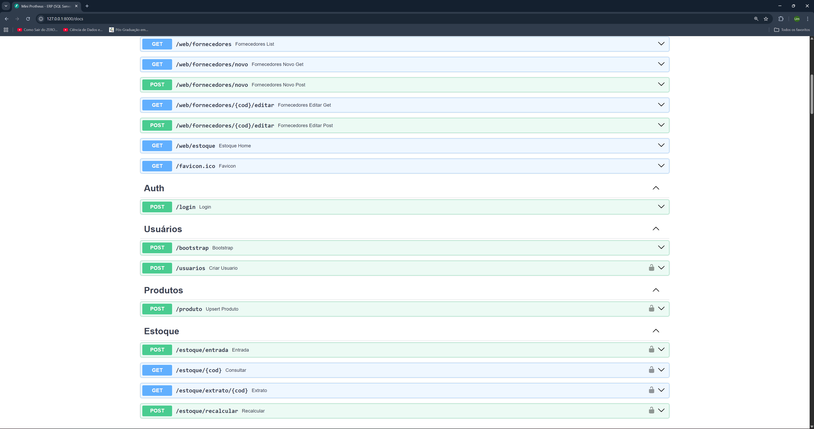
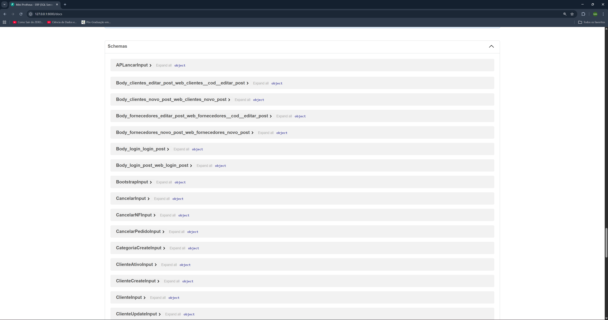
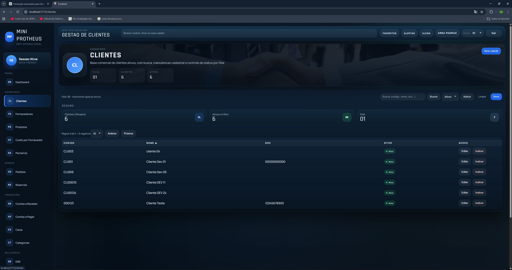
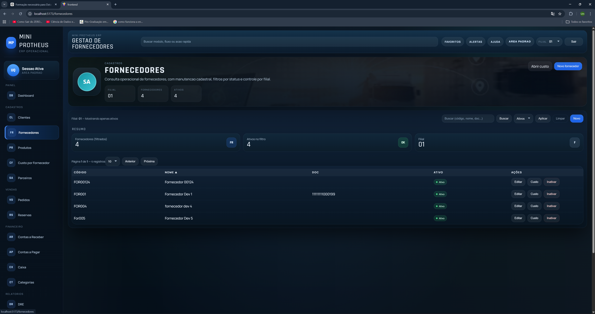
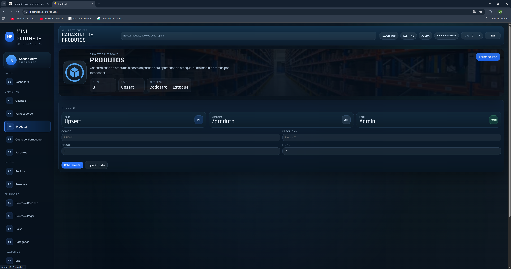
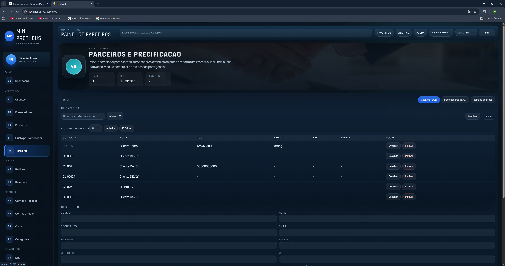
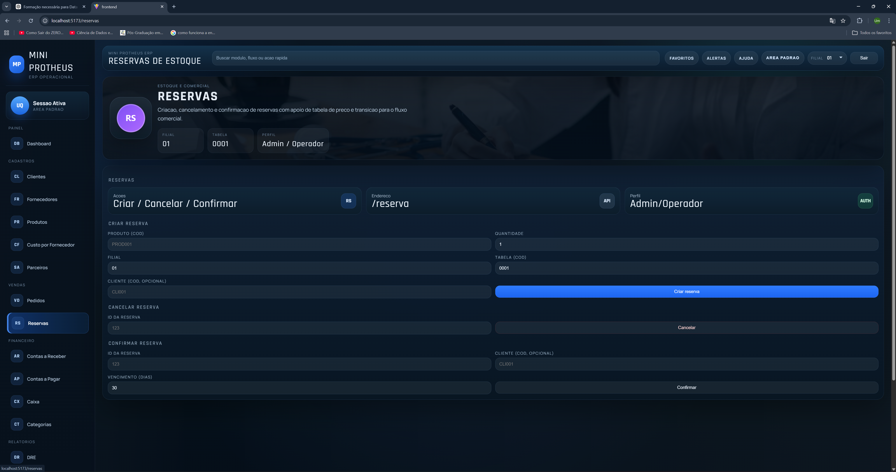
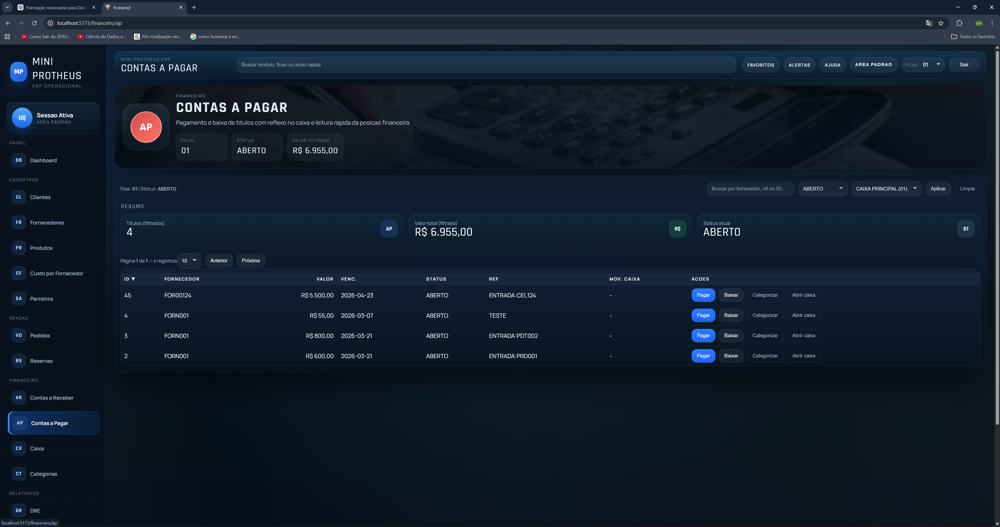

# Mini Protheus

> Versao recomendada para publicacao atual: `v1.0.0-beta.1`

Versao comercial curta para portfolio: [README_PORTFOLIO.md](/c:/Users/umqua/Desktop/mini_protheus/README_PORTFOLIO.md)

ERP enxuto em desenvolvimento, inspirado na organizacao funcional do ecossistema Protheus, com foco em operacao comercial, financeiro, reservas, fiscal e rastreabilidade de fluxo.

O projeto foi estruturado para portfolio tecnico e demonstracao local, sem depender de ambiente online obrigatorio para comunicar valor.

## Resumo

O Mini Protheus combina:

- backend FastAPI exposto como API HTTP
- frontend React + Vite em TypeScript
- persistencia em SQL Server
- regras de negocio organizadas por modulo e fluxo
- testes automatizados para backend e cenarios DB-backed

Hoje ele funciona bem como:

- base de ERP compacta para estudo de arquitetura transacional
- portfolio tecnico de backend + frontend + banco
- demonstracao local guiada por video, screenshots e Swagger

## O Que O Projeto Ja Entrega

- dashboard operacional com navegacao por modulo
- fluxo de `pedido -> faturamento -> AR/AP -> caixa`
- reservas com confirmacao e cancelamento
- DRE simples e margem por produto
- autenticacao JWT
- bootstrap controlado por ambiente
- contrato de erro padronizado na API
- testes automatizados e CI

## Posicionamento

Este projeto nao tenta se vender como um ERP completo de mercado.

O posicionamento correto hoje e:

- mini ERP inspirado em fluxos operacionais do ecossistema Protheus
- foco em comercial, financeiro, reservas, auditoria, precificacao e relatorios gerenciais simples
- produto em maturacao tecnica, ja publicavel como portfolio e demonstracao funcional

## Modulos Principais

### Comercial

- criacao de pedidos
- inclusao e manutencao de itens
- liberacao parcial e total
- faturamento de pedido
- cancelamento, estorno e devolucao de NF

### Parceiros

- clientes
- fornecedores
- associacao de tabela de preco por cliente

### Reservas

- criacao de reserva de estoque
- precificacao pela tabela vigente
- confirmacao com geracao de pedido, NF e AR
- cancelamento com reversao de reserva

### Financeiro

- contas a receber
- contas a pagar
- caixa
- categorias financeiras
- DRE simples

### Fiscal e Consistencia

- TES e regras fiscais
- calculo fiscal por item
- conciliacao entre notas e financeiro
- consistencia fiscal e SD2

### Parametros e Governanca

- bootstrap controlado por ambiente
- politica de one-time setup persistida no banco
- consulta administrativa do estado de setup
- fechamento e reabertura de periodo

## Fluxos De Negocio

### 1. Venda Completa

- criar pedido
- adicionar item
- liberar pedido
- faturar
- gerar contas a receber
- receber e refletir no caixa

### 2. Ciclo de AP

- lancar conta a pagar
- listar titulos
- pagar AP
- refletir saida no caixa

### 3. Reserva de Estoque

- criar reserva
- precificar pela tabela vigente
- confirmar reserva
- gerar pedido, NF e AR
- cancelar quando aplicavel

### 4. Controle Gerencial

- consultar margem por produto
- gerar DRE simples
- rodar conciliacao NF x financeiro
- fechar e reabrir periodo

## Interface

O frontend ja possui paginas para os principais modulos:

- login
- dashboard
- pedidos
- detalhe de pedido
- parceiros
- clientes
- fornecedores
- reservas
- financeiro AR
- financeiro AP
- caixa
- categorias
- produtos
- usuarios
- auditoria
- DRE
- margem por produto

Arquivos de tela em `frontend/src/pages/`:

- `Login.tsx`
- `Dashboard.tsx`
- `pedidosList.tsx`
- `pedidoDetalhe.tsx`
- `parceiros.tsx`
- `clientsList.tsx`
- `FornecedoresList.tsx`
- `reservasList.tsx`
- `financeiroAR.tsx`
- `financeiroAP.tsx`
- `financeiroCaixa.tsx`
- `financeiroCategorias.tsx`
- `relatorioDRE.tsx`
- `relatorioMargemProduto.tsx`
- `usuariosList.tsx`
- `auditoriaList.tsx`

## Evidencias Visuais

Swagger / OpenAPI:





Frontend:












Mais telas em [docs/screenshots/README.md](/c:/Users/umqua/Desktop/mini_protheus/docs/screenshots/README.md).

## Diferenciais Tecnicos

- API pura com frontend desacoplado
- bootstrap protegido por ambiente e bloqueio persistente de setup
- payload de erro uniforme com `detail`, `code`, `error_type` e `request_id`
- request id devolvido em header e payload de erro
- testes de fluxo de negocio em nivel de API
- testes DB-backed opcionais com rollback
- CI preparada para execucao com SQL Server
- deploy preparado para frontend em Vercel e backend em Render/Railway

## Publicacao Sem Site Online

Este projeto pode ser publicado sem manter uma instancia online ativa.

Formato recomendado de apresentacao:

- repositorio com README forte
- screenshots versionadas
- video curto de demonstracao local
- Swagger / docs da API
- testes automatizados visiveis
- PDF do codigo-fonte

Isso permite demonstrar produto, arquitetura e maturidade tecnica sem custo recorrente de hospedagem.

## Demo Local

O modo recomendado de demonstracao e local:

- backend via `uvicorn`
- frontend via Vite
- SQL Server local ou acessivel

Fluxo de demo sugerido:

1. login
2. clientes ou parceiros
3. pedido
4. faturamento
5. financeiro AR/AP
6. caixa
7. DRE ou margem por produto

## Stack

- Backend: FastAPI, JWT (`python-jose`), `pyodbc`
- Frontend: React, React Router, Vite, TypeScript, ESLint
- Banco: SQL Server via ODBC Driver 18

## Requisitos

- Python 3.12+ (testado com 3.14)
- Node.js 20+
- SQL Server acessivel
- ODBC Driver 18 for SQL Server instalado

## Configuracao

No diretorio raiz, crie o arquivo `.env` a partir do exemplo:

```powershell
Copy-Item .env.example .env
```

Variaveis principais:

- `APP_ENV` (`production`, `development`, `setup`)
- `BOOTSTRAP_ENABLED`
- `JWT_SECRET_KEY`
- `CORS_ALLOW_ORIGINS`
- `DB_CONN_STR`

Observacoes:

- a aplicacao e API pura; nao usa sessao server-side nem templates no backend
- `CORS_ALLOW_ORIGINS` tem default voltado ao frontend local (`http://localhost:5173`)
- `.env.example` usa `JWT_SECRET_KEY=change-me-in-development` apenas como valor de desenvolvimento
- em `APP_ENV=production`, a aplicacao falha ao subir se `JWT_SECRET_KEY` estiver ausente ou inseguro

PowerShell e UTF-8:

- se o terminal mostrar acentos quebrados, force UTF-8 antes de inspecionar arquivos:

```powershell
chcp 65001
[Console]::OutputEncoding = [System.Text.Encoding]::UTF8
```

No frontend, crie `frontend/.env` a partir de `frontend/.env.example` e confirme:

```env
VITE_API_BASE_URL=http://127.0.0.1:8000
```

## Executando O Backend

Instale dependencias:

```powershell
python -m pip install -r requirements-dev.txt
```

Suba a API:

```powershell
uvicorn app.main:app --reload
```

API local padrao: `http://127.0.0.1:8000`

Saude da API:

- `http://127.0.0.1:8000/healthz`
- `http://127.0.0.1:8000/docs`

## Executando O Frontend

```powershell
cd frontend
npm install
npm run dev
```

Frontend local padrao: `http://localhost:5173`

## Primeiro Usuario

O sistema nao possui `admin/admin` padrao. O primeiro admin deve ser criado via bootstrap.

Politica de one-time setup:

- `/bootstrap` so responde quando `APP_ENV` for `development` ou `setup`
- exige `BOOTSTRAP_ENABLED=true`
- so funciona enquanto nao existir nenhum usuario
- apos a primeira execucao bem-sucedida, o backend grava setup concluido e bloqueia novas tentativas

Criar admin inicial:

```powershell
$env:APP_ENV="setup"
$env:BOOTSTRAP_ENABLED="true"
$body = @{ login = "admin"; senha = "Troque123!" } | ConvertTo-Json
Invoke-RestMethod `
  -Method Post `
  -Uri "http://127.0.0.1:8000/bootstrap" `
  -ContentType "application/json" `
  -Body $body
```

Validar login:

```powershell
Invoke-RestMethod `
  -Method Post `
  -Uri "http://127.0.0.1:8000/login" `
  -ContentType "application/x-www-form-urlencoded" `
  -Body "username=admin&password=Troque123!"
```

## Contrato De Erro Da API

As respostas de erro seguem um payload uniforme:

```json
{
  "detail": "Pedido sem itens (SC6)",
  "code": "BUSINESS_ERROR",
  "error_type": "business",
  "request_id": "6df2d507-cf4a-4d85-b8db-7b8f81993db0"
}
```

Campos:

- `detail`: mensagem objetiva para cliente e diagnostico
- `code`: codigo estavel do tipo de erro
- `error_type`: categoria (`business`, `auth`, `authorization`, `conflict`, `validation`, `http`, `internal`)
- `request_id`: mesmo valor devolvido no header `X-Request-Id`

Padrao HTTP:

- `400`: regra de negocio
- `401`: autenticacao ou token invalido
- `403`: autorizacao ou perfil insuficiente
- `404`: endpoint ou recurso indisponivel
- `409`: conflito de dados
- `422`: payload invalido
- `500`: erro interno

## Qualidade E Testes

Backend:

```powershell
pytest -q
```

Testes de integracao com banco real:

```powershell
$env:TEST_DB_CONN_STR="DRIVER={ODBC Driver 18 for SQL Server};SERVER=localhost;DATABASE=ERP_PROTHEUS_TEST;Trusted_Connection=yes;Encrypt=yes;TrustServerCertificate=yes;"
pytest -q tests/test_business_flows_db.py
```

Se voce ja tem dados no SQL Server local, crie uma base separada de testes.
Existe um script para isso em [sql_create_test_database.sql](/c:/Users/umqua/Desktop/mini_protheus/sql_create_test_database.sql).

Depois inicialize o schema minimo da base de testes:

```powershell
$env:TEST_DB_ADMIN_CONN_STR="DRIVER={ODBC Driver 18 for SQL Server};SERVER=localhost;DATABASE=master;Trusted_Connection=yes;Encrypt=yes;TrustServerCertificate=yes;"
$env:TEST_DB_CONN_STR="DRIVER={ODBC Driver 18 for SQL Server};SERVER=localhost;DATABASE=ERP_PROTHEUS_TEST;Trusted_Connection=yes;Encrypt=yes;TrustServerCertificate=yes;"
python tests/init_integration_db.py
pytest -q tests/test_business_flows_db.py
```

Cobertura funcional atual dos testes DB-backed:

- pedido -> item -> faturamento -> AR -> recebimento -> caixa
- AP -> pagamento -> caixa
- reserva -> confirmacao
- margem por produto
- DRE
- conciliacao NF/financeiro
- consistencia fiscal/SD2
- fechamento e reabertura de periodo

CI:

- `.github/workflows/tests.yml` roda a suite padrao em push e PR
- ha job para testes principais e job DB-backed com SQL Server

## Estrutura

- `app/`: backend FastAPI
- `app/api/routers/`: rotas da API
- `app/use_cases/`: regras de negocio
- `app/infra/`: acesso a dados e repositorios
- `frontend/src/`: aplicacao React
- `tests/`: testes automatizados do backend
- `docs/screenshots/`: evidencias visuais

## Deploy

O projeto esta preparado para deploy, mas nao depende disso para ser apresentado.

Frontend:

- Vercel
- Root Directory: `frontend`
- Build Command: `npm run build`
- Output Directory: `dist`
- variavel obrigatoria: `VITE_API_BASE_URL=https://URL_DO_BACKEND`

Backend:

- Render ou Railway
- imagem baseada no [Dockerfile](/c:/Users/umqua/Desktop/mini_protheus/Dockerfile)
- suporta porta dinamica via `PORT`
- healthcheck em `/healthz`

Variaveis obrigatorias em producao:

- `APP_ENV=production`
- `JWT_SECRET_KEY`
- `DB_CONN_STR`
- `CORS_ALLOW_ORIGINS`

Exemplo de `CORS_ALLOW_ORIGINS`:

- `https://seu-frontend.vercel.app`

Observacao:

- o deploy esta preparado no repositorio
- a demonstracao principal recomendada continua sendo local

## Limitacoes Atuais

- compras ainda nao existem como modulo formal de pedido de compra
- custo por fornecedor existe, mas ainda nao representa um SIGACOM completo
- estoque ainda nao possui armazem/local, lote, validade e inventario formal
- fiscal cobre cenarios basicos, mas nao a profundidade de um ERP maduro
- governanca de permissao ainda e basica; nao ha ACL fina por modulo/acao
- a plataforma e propria (`FastAPI + React + SQL Server`), inspirada no Protheus em fluxo de negocio, nao equivalente tecnico ao Protheus

## Roadmap

### Curto Prazo

- consolidar homologacao funcional ponta a ponta
- ampliar documentacao por fluxo
- expandir exemplos OpenAPI
- refinar contratos restantes da API

### Medio Prazo

- criar modulo formal de compras
- aumentar cobertura de testes integrados com banco real
- adicionar mais cenarios negativos
- endurecer validacoes de periodo, fiscal e conciliacao

### Longo Prazo

- maturidade de deploy
- controle mais fino de permissao por modulo
- dashboards e indicadores operacionais
- compras, estoque avancado e fiscal mais profundo

## Material De Apoio

- [CHANGELOG.md](/c:/Users/umqua/Desktop/mini_protheus/CHANGELOG.md)
- [RELEASE_CHECKLIST.md](/c:/Users/umqua/Desktop/mini_protheus/RELEASE_CHECKLIST.md)
- [postman_collection.json](/c:/Users/umqua/Desktop/mini_protheus/postman_collection.json)
- [mini_protheus_codigo_fonte.pdf](/c:/Users/umqua/Desktop/mini_protheus/mini_protheus_codigo_fonte.pdf)

## Conclusao

O Mini Protheus ja comunica bem valor tecnico mesmo sem ambiente online:

- produto com identidade clara
- arquitetura modular
- fluxo de negocio real
- frontend funcional
- API documentada
- testes automatizados
- deploy preparado

Para portfolio, isso ja sustenta uma apresentacao forte.
