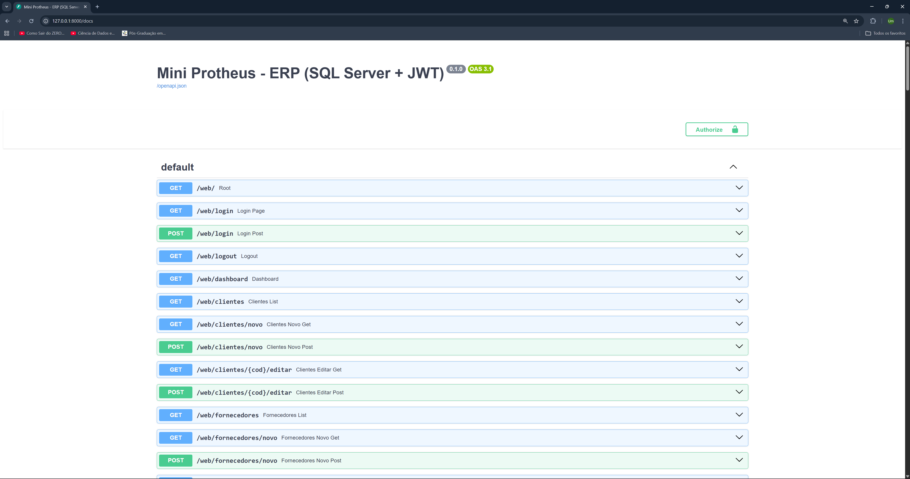
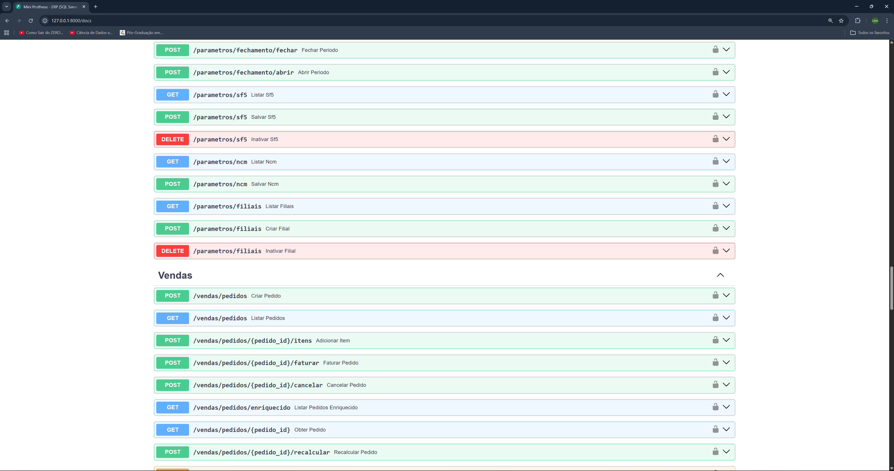
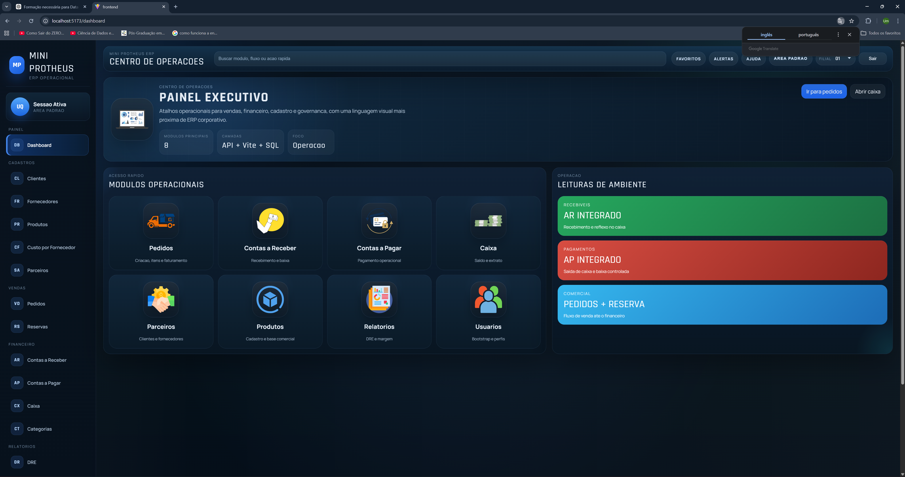
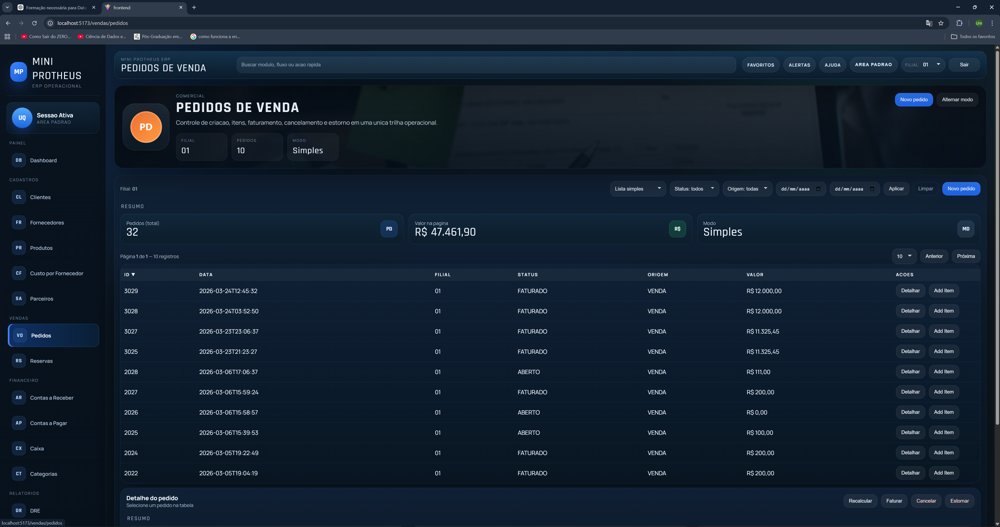
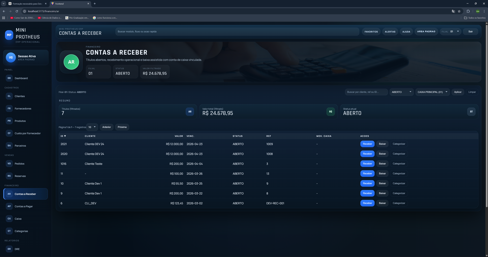
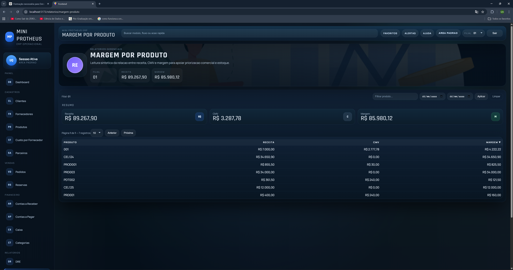

# Mini Protheus

Mini ERP inspirado em fluxos operacionais do ecossistema Protheus, desenvolvido como produto em evolucao e portfolio tecnico.

O foco atual do projeto e demonstrar capacidade de construir uma base transacional real, com:

- frontend React
- backend FastAPI
- persistencia em SQL Server
- modulos comerciais e financeiros integrados
- regras de negocio organizadas por fluxo

## O Que Este Projeto Demonstra

- arquitetura full stack desacoplada
- modelagem de fluxo comercial e financeiro
- autenticacao e contrato de API
- integracao entre pedido, faturamento, AR/AP e caixa
- preocupacao com testes, CI e rastreabilidade

## Principais Funcionalidades

- pedidos de venda com itens
- liberacao e faturamento
- contas a receber
- contas a pagar
- caixa
- reservas
- clientes e fornecedores
- auditoria
- DRE simples
- margem por produto

## Diferenciais

- API com contrato de erro padronizado
- bootstrap inicial protegido por ambiente
- request id para rastreabilidade
- testes automatizados cobrindo fluxos relevantes
- organizacao por modulos de negocio
- deploy preparado para Vercel + Render/Railway

## Stack

- React + Vite + TypeScript
- FastAPI
- SQL Server
- JWT
- pyodbc

## Telas E Evidencias

Swagger / API:

Frontend:

Mais imagens em [docs/screenshots/README.md](/c:/Users/umqua/Desktop/mini_protheus/docs/screenshots/README.md).

## Como Apresentar

Este projeto pode ser apresentado de tres formas:

1. demonstracao local com frontend + backend
2. walkthrough por screenshots e Swagger
3. leitura tecnica do repositorio

Fluxo recomendado de demo:

1. login
2. clientes ou parceiros
3. pedido
4. faturamento
5. financeiro
6. DRE ou margem por produto

## Estado Atual

O projeto esta em maturacao, mas ja comunica valor tecnico com clareza.

Hoje ele deve ser entendido como:

- ERP enxuto funcional
- base de estudo e evolucao de arquitetura transacional
- portfolio tecnico full stack com regras de negocio reais

## Limitacoes Atuais

- compras ainda nao existem como modulo formal
- estoque ainda nao cobre cenarios avancados
- fiscal cobre cenarios basicos, nao profundidade completa de ERP maduro
- controle de permissao ainda e basico

## Material Tecnico

- README tecnico principal: [README.md](/c:/Users/umqua/Desktop/mini_protheus/README.md)
- changelog: [CHANGELOG.md](/c:/Users/umqua/Desktop/mini_protheus/CHANGELOG.md)
- checklist de release: [RELEASE_CHECKLIST.md](/c:/Users/umqua/Desktop/mini_protheus/RELEASE_CHECKLIST.md)
- colecao Postman: [postman_collection.json](/c:/Users/umqua/Desktop/mini_protheus/postman_collection.json)

## Resumo

O Mini Protheus nao tenta simular um ERP completo de mercado.

Ele demonstra algo mais importante para portfolio: capacidade de desenhar e implementar uma aplicacao de negocio com identidade clara, integracao entre modulos, backend estruturado, frontend funcional e preocupacao real com qualidade tecnica.
